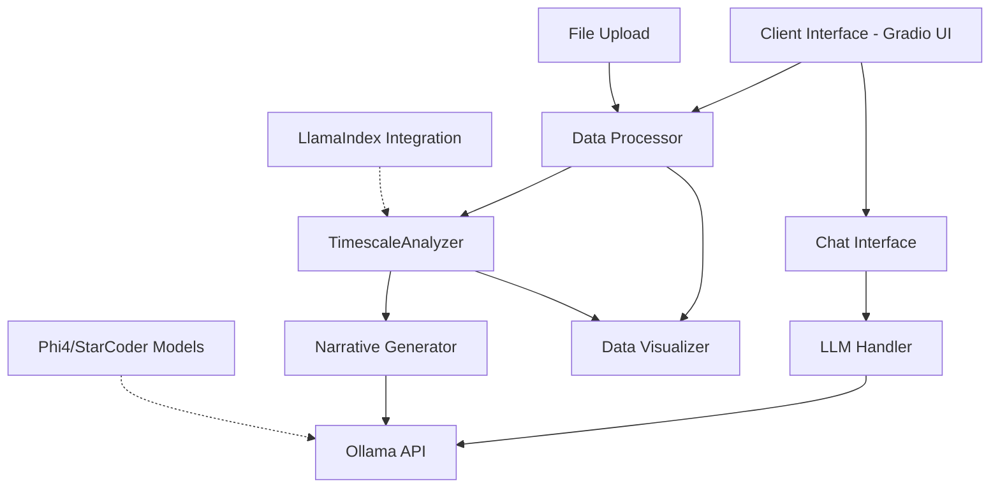
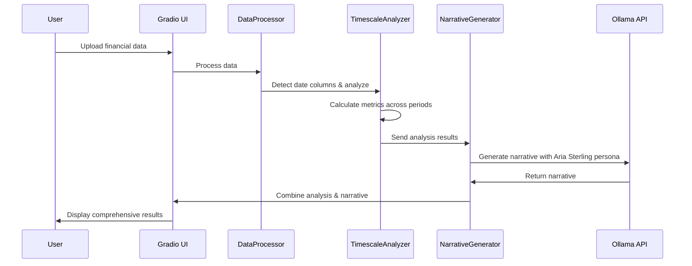
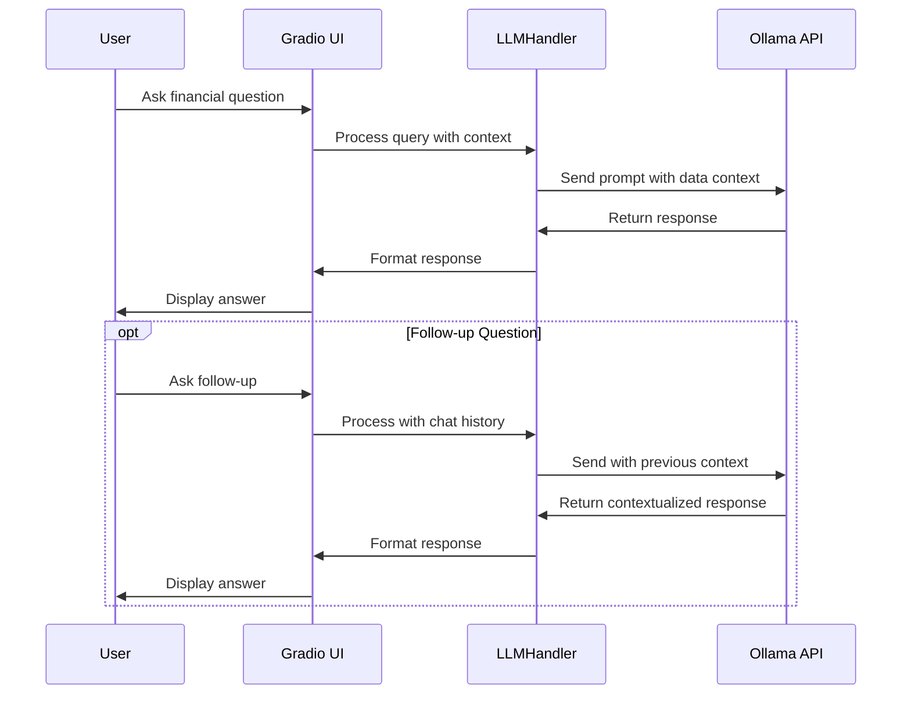

# VariancePro Product Specification

## 1. Executive Summary

VariancePro is an advanced financial analysis tool designed to help financial analysts, business managers, and data scientists analyze financial data with precision and generate insightful narratives. The application combines powerful time series analysis capabilities with natural language processing to provide both quantitative analysis and qualitative insights.

The core value proposition of VariancePro is its ability to automatically detect patterns in financial data across different time scales (YoY, QoQ, MoM, WoW), calculate relevant metrics, visualize trends, and generate professional financial narratives using the "Aria Sterling" financial analyst persona.

## 2. Product Overview

### 2.1 Problem Statement

Financial professionals face several challenges when analyzing data:
- Time-consuming manual calculations across different time periods
- Need for consistent analysis methodologies
- Requirement to create professional narratives from raw data
- Difficulty in identifying significant trends and patterns
- Need to communicate insights effectively to stakeholders

### 2.2 Solution

VariancePro addresses these challenges through:
- Automated time series analysis with multi-period comparisons
- Consistent calculation methodologies for financial metrics
- LLM-powered narrative generation with a professional financial analyst persona
- Visualization capabilities for effective communication
- Chat interface for ad-hoc financial data queries

## 3. Core Features

### 3.1 Automated Time Series Analysis

The TimescaleAnalyzer component automatically:
- Identifies date columns in financial datasets
- Calculates period-over-period changes (YoY, QoQ, MoM, WoW)
- Identifies trends, growth rates, and significant changes
- Summarizes key metrics in an executive summary

### 3.2 Narrative Generation

The narrative generator:
- Creates human-like financial commentary using the "Aria Sterling" persona
- Transforms raw data insights into professional financial language
- Customizes tone and detail based on context
- Operates even without internet connectivity using fallback mechanisms

### 3.3 LLM-Powered Financial Chat

The application offers:
- Chat interface for financial data queries
- Integration with locally-hosted LLMs via Ollama
- Support for various models (DeepSeek Coder, StarCoder, etc.)
- Context-aware responses based on loaded financial data

### 3.4 Data Processing and Visualization

VariancePro includes:
- Automatic detection of financial column types
- Calculation of summary statistics
- Data visualization with Plotly
- Interactive data exploration capabilities

## 4. Use Cases

### 4.1 Financial Report Generation

**User:** Financial Analyst
**Scenario:** Monthly financial review meeting
**Flow:**
1. User uploads latest financial data CSV
2. VariancePro automatically detects date and numeric columns
3. System generates time series analysis across multiple periods
4. Narrative generator creates professional commentary
5. User exports or presents the combined quantitative and narrative insights

### 4.2 Ad-hoc Financial Analysis

**User:** Business Manager
**Scenario:** Unexpected variance in quarterly results
**Flow:**
1. User loads quarterly financial data
2. VariancePro performs time series analysis
3. User asks specific questions about variances through chat interface
4. LLM provides context-aware answers based on the data
5. User drills down into specific metrics for further investigation

### 4.3 Executive Summary Creation

**User:** Financial Director
**Scenario:** Board meeting preparation
**Flow:**
1. User uploads company performance data
2. System generates comprehensive analysis across time periods
3. Narrative generator creates executive-level commentary
4. User extracts key insights for presentation
5. System helps answer anticipated questions from board members

### 4.4 Financial Trend Identification

**User:** Data Scientist
**Scenario:** Identifying emerging trends in sales data
**Flow:**
1. User loads historical sales data
2. VariancePro detects patterns across multiple time periods
3. System highlights significant changes and trends
4. User asks follow-up questions through chat interface
5. LLM provides deeper analysis of identified trends

## 5. System Architecture

### 5.1 Component Diagram



### 5.2 Key Components

1. **Gradio UI Layer**: Web-based user interface
2. **Data Processor**: Handles data loading, preprocessing and basic analysis
3. **TimescaleAnalyzer**: Core analysis engine for time-based financial metrics
4. **Narrative Generator**: Creates professional financial commentary
5. **LLM Handler**: Manages interactions with language models
6. **Ollama Integration**: Connects to locally-hosted language models

## 6. Sequence Diagrams

### 6.1 Data Analysis Flow



### 6.2 Chat Interaction Flow



## 7. File Structure

```
VariancePro/
├── app.py                  # Main application with Phi4 integration
├── gradio_app.py           # Alternative app with StarCoder integration
├── requirements.txt        # Core dependencies
├── requirements_gradio.txt # Gradio-specific dependencies
├── utils/
│   ├── __init__.py
│   ├── data_processor.py   # Data processing utilities
│   ├── narrative_generator.py # Aria Sterling persona & narrative generation
│   ├── chat_handler.py     # Chat processing utilities
│   └── llm_handler.py      # LLM integration utilities
├── sample_data/            # Example financial datasets
│   ├── comprehensive_sales_data.csv
│   ├── sales_budget_actuals.csv
│   └── sample_stock_data.csv
├── test_*.py               # Various test files
└── setup_*.py              # Setup scripts for different models
```

## 8. Technology Stack

- **Backend**: Python 3.9+
- **UI Framework**: Gradio 4.0+
- **Data Processing**: Pandas 2.0+, NumPy 1.24+
- **LLM Integration**: Ollama, with support for various models
- **Visualization**: Plotly 5.15+

## 9. Key Dependencies

- `gradio`: Web interface
- `pandas`: Data manipulation
- `numpy`: Numerical operations
- `plotly`: Data visualization
- `ollama`: Local LLM integration
- `requests`: API communication
- `python-dateutil`: Date handling

## 10. Future Roadmap

### 10.1 Short-term Enhancements
- Enhanced visualization capabilities
- Additional financial metrics and ratios
- Customizable narrative styles

### 10.2 Medium-term Features
- PDF report export functionality
- API access for headless operation
- Integration with financial data sources

### 10.3 Long-term Vision
- Enterprise deployment options
- Advanced forecasting capabilities
- Integration with business intelligence platforms

## 11. Installation and Setup

### 11.1 Prerequisites
- Python 3.9+
- Ollama (for local LLM capabilities)
- 8GB+ RAM recommended

### 11.2 Installation Steps
1. Clone the repository
2. Install dependencies: `pip install -r requirements.txt`
3. Install Ollama and download required models
4. Run the application: `python app.py` or `python gradio_app.py`

## 12. Configuration Options

- **LLM Selection**: Choose between different models (DeepSeek, StarCoder, etc.)
- **Narrative Style**: Configure level of detail in generated narratives
- **Visualization Options**: Customize charts and visual elements
- **Analysis Parameters**: Adjust thresholds for significant changes

---

*Document Version: 1.0*  
*Last Updated: June 29, 2025*
