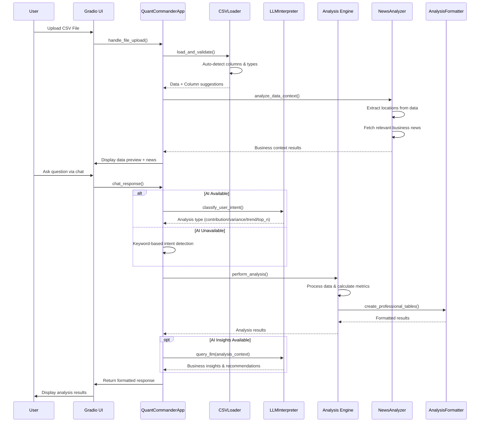

# VariancePro - Professional Financial Analysis Platform

<div align="center">
  
  
  [](https://opensource.org/licenses/MIT)
  [](https://www.python.org/downloads/)
  [](https://gradio.app/)
  [](https://github.com/sharkoil/variancepro)
</div>

## 🚀 Overview

VariancePro is a cutting-edge AI-powered financial analysis platform that transforms raw CSV data into actionable business insights. Built with modern web technologies and powered by local AI models, it provides professional-grade analysis capabilities without compromising data privacy.

### ✨ Key Features

- **🤖 AI-Powered Analysis**: Chat with Aria Sterling, your AI financial analyst
- **📊 Multiple Analysis Types**: Contribution, variance, trend, and top/bottom N analysis
- **🔒 Privacy-First**: All processing happens locally - your data never leaves your machine
- **📈 Professional Reporting**: Beautiful tables, charts, and formatted insights
- **🎯 Intelligent Column Detection**: Automatically identifies categories, values, dates, and budget columns
- **📰 Business Context**: Integrates relevant news analysis for location-based data
- **⚡ Real-Time Chat**: Interactive conversation interface for data exploration

## 🛠️ Technology Stack

- **Frontend**: Gradio web interface with custom CSS styling
- **Backend**: Python with pandas for data processing
- **AI Engine**: Ollama with Gemma3 model for local AI inference
- **Data Processing**: Advanced CSV parsing with automatic column type detection
- **Analysis Engine**: Modular analyzer architecture for extensible functionality

## 📋 Requirements

- Python 3.8 or higher
- 8GB+ RAM (recommended for AI model)
- Ollama installed locally
- Modern web browser

## 🚀 Quick Start

### 1. Clone the Repository
```bash
git clone https://github.com/sharkoil/variancepro.git
cd variancepro
```

### 2. Install Dependencies
```bash
pip install -r requirements.txt
```

### 3. Install and Setup Ollama
```bash
# Install Ollama (visit https://ollama.ai for platform-specific instructions)
# Pull the Gemma3 model
ollama pull gemma3:latest
```

### 4. Run the Application
```bash
python app_new.py
```

The application will start on `http://localhost:7871` by default.

## 💡 Usage

### Data Upload
1. Click "Upload CSV File" and select your financial data
2. The system automatically analyzes your data structure
3. Column suggestions appear in the Field Picker section

### Analysis Types

#### 📈 Contribution Analysis (80/20 Pareto)
Identifies the top contributors to your metrics using Pareto principle analysis.

#### 💰 Variance Analysis
Compares budget vs. actual values to identify performance gaps and opportunities.

#### 📊 Trend Analysis
Analyzes time-series data for patterns, growth trends, and seasonal variations.

#### 🔝 Top/Bottom N Analysis
Ranks categories by performance metrics with detailed breakdown tables.

### Chat Interface
Simply type natural language questions like:
- "Show me the top 10 products by sales"
- "Analyze variance between budget and actual"
- "What are the trends in revenue over time?"
- "Which states are performing worst?"

## 🏗️ Architecture

```
variancepro/
├── ai/                     # AI and LLM integration
├── analyzers/              # Data analysis modules
├── config/                 # Configuration management
├── data/                   # Data processing utilities
├── utils/                  # Utility functions
├── sample_data/            # Example datasets
├── tests/                  # Unit tests
├── app_new.py             # Main application
└── requirements.txt       # Dependencies
```

### System Flow Diagram



### Core Components

- **QuantCommanderApp**: Main application orchestrator
- **CSVLoader**: Intelligent data parsing and validation
- **AnalysisFormatter**: Professional table and report formatting
- **ContributorAnalyzer**: 80/20 Pareto analysis engine
- **FinancialAnalyzer**: Variance and trend analysis
- **NewsAnalyzer**: Business context integration
- **LLMInterpreter**: AI conversation and insights

## 🔧 Configuration

The application can be configured through environment variables:

```bash
# AI Model Configuration
VARIANCEPRO_LLM_MODEL=gemma3:latest
OLLAMA_HOST=http://localhost:11434
VARIANCEPRO_LLM_TIMEOUT=180

# Server Configuration
GRADIO_SERVER_PORT=7871
GRADIO_SHARE=false

# Analysis Configuration
VARIANCEPRO_CONTRIBUTION_THRESHOLD=0.8
```

## 📊 Supported Data Formats

- **CSV Files**: Primary format with automatic delimiter detection
- **Excel Files**: .xlsx and .xls support via openpyxl
- **Encoding**: UTF-8, Latin-1, and other common encodings

### Expected Data Structure

Your CSV should contain:
- **Date columns**: For time-series analysis
- **Category columns**: For grouping (Product, State, Department, etc.)
- **Value columns**: Numeric metrics (Sales, Revenue, etc.)
- **Budget columns**: For variance analysis (Budget, Target, Plan, etc.)

## 🎯 Analysis Examples

### Sample Data Structure
```csv
Date,Product,State,Budget,Actual,Category
2024-01-01,Widget A,California,10000,12000,Electronics
2024-01-01,Widget B,Texas,8000,7500,Electronics
2024-02-01,Service X,New York,15000,16500,Services
```

### Generated Insights
- **Contribution**: "Top 20% of products generate 80% of revenue"
- **Variance**: "Actual performance exceeded budget by 15% in Q1"
- **Trends**: "Revenue shows consistent 8% monthly growth"
- **Rankings**: "California leads with $2.1M total sales"

## 🛡️ Privacy & Security

- **Local Processing**: All analysis happens on your machine
- **No Data Upload**: CSV files are processed locally only
- **AI Privacy**: Uses local Ollama models, no cloud AI services
- **No Telemetry**: No usage data is collected or transmitted

## 🤝 Contributing

We welcome contributions! Please see [CONTRIBUTING.md](CONTRIBUTING.md) for guidelines.

### Development Setup
```bash
# Clone repository
git clone https://github.com/sharkoil/variancepro.git
cd variancepro

# Create virtual environment
python -m venv venv
source venv/bin/activate  # On Windows: venv\Scripts\activate

# Install development dependencies
pip install -r requirements.txt
pip install pytest black flake8

# Run tests
pytest tests/
```

## 📄 License

This project is licensed under the MIT License - see the [LICENSE](LICENSE) file for details.

## 🔗 Links

- **Repository**: [https://github.com/sharkoil/variancepro](https://github.com/sharkoil/variancepro)
- **Issues**: [https://github.com/sharkoil/variancepro/issues](https://github.com/sharkoil/variancepro/issues)
- **Ollama**: [https://ollama.ai](https://ollama.ai)
- **Gradio**: [https://gradio.app](https://gradio.app)

## 🙏 Acknowledgments

- **Ollama Team**: For the excellent local AI inference platform
- **Gradio Team**: For the intuitive web interface framework
- **Pandas Community**: For the powerful data analysis capabilities
- **Open Source Community**: For the foundational libraries and tools

---

<div align="center">
  <strong>Transform your financial data into actionable insights with VariancePro</strong>
  <br>
  <em>Professional analysis powered by artificial intelligence</em>
</div>
