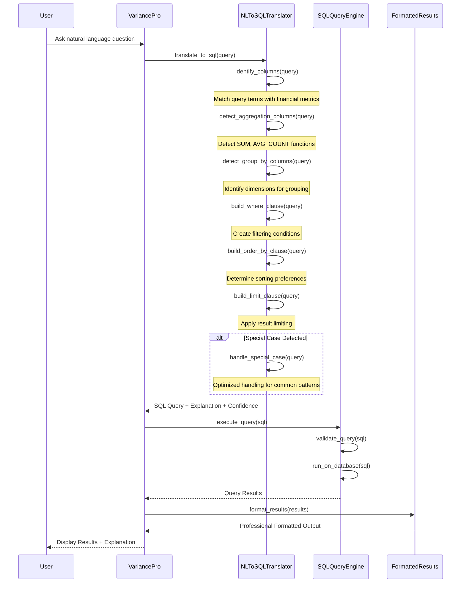
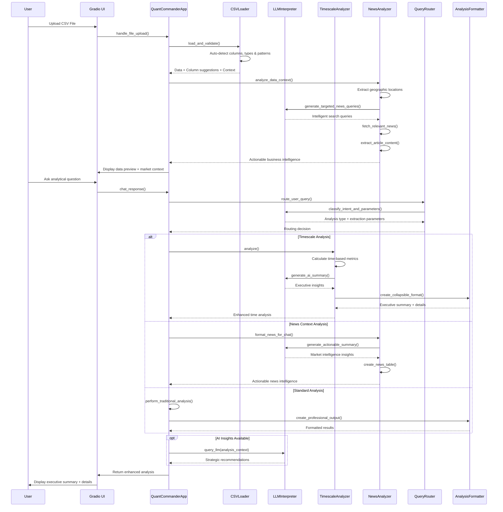

# VariancePro - AI-Powered Financial Intelligence Platform

<div align="center">
  
  
  [](https://opensource.org/licenses/MIT)
  [](https://www.python.org/downloads/)
  [](https://gradio.app/)
  [](https://github.com/sharkoil/variancepro)
  [](https://github.com/sharkoil/variancepro)
</div>

## 🚀 Overview

VariancePro is a revolutionary AI-powered financial intelligence platform that transforms raw CSV data into comprehensive business insights with actionable market intelligence. Built with advanced AI models and powered by local inference, it provides enterprise-grade analysis capabilities while maintaining complete data privacy.

**🎯 What makes VariancePro unique:**
- **AI-Generated Executive Summaries** for complex time-series analysis
- **Actionable News Intelligence** that correlates market factors with data patterns
- **Collapsible Detail Views** for executive-level reporting with drill-down capabilities
- **Real-time Market Context** through RSS feed integration and content extraction
- **Zero-Trust Privacy** with 100% local processing

### ✨ Core Features

- **🤖 AI-Powered Analysis**: Chat with Aria Sterling, your AI financial analyst
- **📊 Advanced Analytics**: Contribution, variance, timescale, and ranking analysis
- **🧠 Executive Summaries**: AI-generated concise insights with expandable details
- **📰 Market Intelligence**: Actionable news analysis correlated with your data patterns
- **🔒 Privacy-First**: All processing happens locally - your data never leaves your machine
- **📈 Professional Reporting**: Publication-ready tables, charts, and executive reports
- **🎯 Intelligent Detection**: Auto-identifies data types, patterns, and business context
- **⚡ Real-Time Chat**: Natural language interface for data exploration and insights
- **🌐 RSS Integration**: Live news feeds for business context without API costs
- **📄 Article Extraction**: Deep content analysis from news sources for better intelligence

## 🛠️ Technology Stack

- **Frontend**: Gradio web interface with custom CSS styling and responsive design
- **Backend**: Python with pandas for advanced data processing and analysis
- **AI Engine**: Ollama with Gemma3 model for local AI inference and natural language processing
- **News Intelligence**: RSS feed integration with feedparser and content extraction
- **Data Processing**: Advanced CSV parsing with automatic column type detection and validation
- **Analysis Engine**: Modular analyzer architecture with AI-enhanced summaries
- **Security**: Zero-trust local processing with no external data transmission

## 📋 Requirements

- Python 3.8 or higher
- 8GB+ RAM (recommended for AI model performance)
- Ollama installed locally with Gemma3 model
- Modern web browser (Chrome, Firefox, Safari, Edge)
- Internet connection (for news intelligence features only)

## 🚀 Quick Start

### 1. Clone the Repository
```bash
git clone https://github.com/sharkoil/variancepro.git
cd variancepro
```

### 2. Install Dependencies
```bash
pip install -r requirements.txt
```

### 3. Install and Setup Ollama
```bash
# Install Ollama (visit https://ollama.ai for platform-specific instructions)
# Pull the Gemma3 model
ollama pull gemma3:latest
```

### 4. Run the Application
```bash
python app_new.py
```

The application will start on `http://localhost:7871` by default.

## 💡 Usage Guide

### Data Upload & Analysis
1. **Upload CSV File**: Click "Upload CSV File" and select your financial data
2. **Auto-Detection**: The system automatically analyzes your data structure and suggests columns
3. **Field Mapping**: Review and adjust column mappings in the Field Picker section
4. **Instant Analysis**: Chat interface becomes active with contextual business insights

### 🎯 Analysis Types

#### 📈 Contribution Analysis (Pareto 80/20)
**Purpose**: Identifies the critical few contributors driving majority of your results
- **Use Case**: Product profitability, customer analysis, sales territory performance
- **Output**: Ranked contributors with cumulative percentages and visual indicators
- **AI Enhancement**: Executive summary highlighting key insights and business implications

#### 💰 Variance Analysis
**Purpose**: Compares planned vs. actual performance to identify gaps and opportunities
- **Use Case**: Budget vs. actual analysis, forecast accuracy, performance monitoring
- **Output**: Variance tables with percentage deviations and trend indicators
- **AI Enhancement**: Contextual insights on performance drivers and recommendation priorities

#### ⏱️ Timescale Analysis (NEW!)
**Purpose**: Advanced time-series analysis with AI-powered executive summaries
- **Use Case**: Revenue trends, seasonal patterns, growth analysis, performance tracking
- **Output**: Comprehensive time-based insights with collapsible detail views
- **AI Features**: 
  - 🧠 **Executive Summary**: Concise AI-generated insights highlighting key findings
  - 📊 **Detailed Analysis**: Expandable sections with comprehensive metrics and trends
  - 📈 **Pattern Recognition**: AI identification of seasonal trends, growth patterns, and anomalies

#### 🔝 Top/Bottom N Analysis
**Purpose**: Ranks categories by performance metrics with detailed breakdowns
- **Use Case**: Best/worst performers, competitive analysis, resource allocation
- **Output**: Ranked tables with performance metrics and comparative analysis
- **AI Enhancement**: Strategic recommendations based on performance patterns

### 📰 Business Context Intelligence (NEW!)

**Actionable News Intelligence System** - Revolutionary feature that correlates market factors with your data patterns:

#### 🎯 Market Intelligence Summary
- **AI-Generated Insights**: Contextual analysis of how current market conditions may impact your business
- **Geographic Correlation**: Location-based news analysis tied to your data geography
- **Industry Context**: Sector-specific news intelligence relevant to your business metrics
- **Performance Impact**: Quantified estimates of how market factors may influence your KPIs

#### 📊 News Sources Table
- **Curated Headlines**: Relevant business news filtered for your industry and geography
- **Direct Links**: Clickable access to full articles for deeper research
- **Source Diversity**: Multiple news sources for comprehensive market view
- **Date Relevance**: Recent news prioritized for current market conditions

#### 🔍 Intelligent Content Extraction
- **Article Analysis**: Deep content extraction beyond headlines for richer insights
- **Sentiment Analysis**: Understanding market sentiment and its potential business impact
- **Trend Correlation**: Connecting news trends with data patterns in your business metrics

### 💬 Natural Language Chat Interface

Transform complex data questions into instant insights:

**Example Queries:**
- *"Show me the top 10 products by sales with market context"*
- *"Analyze budget variance and explain any external factors"*
- *"What are the revenue trends and how do current economic conditions affect them?"*
- *"Which regions are underperforming and what market factors might explain this?"*
- *"Generate an executive summary of our Q3 performance with business intelligence"*

**Chat Features:**
- **Intent Recognition**: AI automatically determines the best analysis type for your question
- **Context Awareness**: Remembers previous conversations and data context
- **Executive Summaries**: One-click access to AI-generated insights with expandable details
- **Market Integration**: Automatically includes relevant business context when applicable

## 🔍 Enhanced NL-to-SQL Translation

VariancePro now features a robust Natural Language to SQL translator that enables business users to query financial data using plain English instead of complex SQL syntax.

### Key Features

- **Natural Language Queries**: Ask questions in plain English like "Show me sales greater than 60000"
- **Financial Domain Knowledge**: Built-in understanding of financial terminology and metrics
- **Pattern Recognition**: Advanced pattern matching for business metrics, comparisons, and aggregations
- **Confidence Scoring**: Transparent query confidence with detailed explanations
- **Special Case Handling**: Optimized handling for common financial query patterns

### Sequence Diagram



### Example Queries

The enhanced translator successfully handles diverse financial queries:

1. **Filtering**: "Show me sales greater than 60000"
2. **Comparisons**: "Find transactions where actual sales is less than budget sales"
3. **Percentages**: "List products where discount percentage is greater than 2%"
4. **Multiple Conditions**: "Show regions with customer satisfaction above 3 and negative variance"
5. **Aggregations**: "Total actual sales by region where budget sales is greater than 50000"
6. **Averages**: "Average discount percentage by product line"
7. **Top N**: "Top 5 regions by actual sales"
8. **Ranking**: "Find products with highest customer satisfaction"

### Usage Example

```python
from analyzers.enhanced_nl_to_sql_translator_final_complete import EnhancedNLToSQLTranslator

# Initialize the translator
translator = EnhancedNLToSQLTranslator()

# Set the schema context
translator.set_schema_context(schema_info, "financial_data")

# Translate a natural language query
result = translator.translate_to_sql("Top 5 regions by actual sales")

if result.success:
    print(f"SQL: {result.sql_query}")
    print(f"Explanation: {result.explanation}")
    print(f"Confidence: {result.confidence}")
    
    # Execute the query with your database connector
    # ...
```

## 🏗️ System Architecture

```
variancepro/
├── ai/                         # AI and LLM integration
│   ├── llm_interpreter.py     # Core AI conversation engine
│   └── narrative_generator.py # AI-powered content generation
├── analyzers/                  # Advanced data analysis modules
│   ├── base_analyzer.py       # Foundation classes and formatting
│   ├── contributor_analyzer.py # Pareto 80/20 analysis
│   ├── financial_analyzer.py  # Variance and financial metrics
│   ├── timescale_analyzer.py  # Time-series with AI summaries
│   ├── news_analyzer_v2.py    # Actionable news intelligence
│   └── query_router.py        # Intelligent query routing
├── config/                     # Configuration management
│   └── settings.py            # Application settings and AI config
├── data/                       # Data processing utilities
│   └── csv_loader.py          # Intelligent CSV parsing
├── utils/                      # Utility functions
│   └── llm_handler.py         # LLM communication utilities
├── tests/                      # Comprehensive unit tests
├── sample_data/               # Example datasets for testing
├── app_new.py                 # Main application orchestrator
└── requirements.txt           # Python dependencies
```

### Enhanced System Flow Diagram



### 🧠 AI-Enhanced Components

#### 1. **TimescaleAnalyzer** (Enhanced)
- **Executive Summary Generation**: AI creates concise insights from complex time-series data
- **Collapsible Detail Views**: Professional presentation with expandable sections
- **Pattern Recognition**: AI identifies trends, seasonality, and anomalies
- **Business Impact Analysis**: Quantified insights on performance implications

#### 2. **NewsAnalyzer V2** (Redesigned)
- **Actionable Intelligence**: Focuses on market factors affecting data patterns
- **Geographic Correlation**: Location-based news analysis
- **Content Extraction**: Deep article analysis beyond headlines
- **Business Impact Scoring**: AI assessment of news relevance to business metrics

#### 3. **LLMInterpreter** (Core AI Engine)
- **Intent Classification**: Natural language query understanding
- **Context Awareness**: Maintains conversation state and data context
- **Multi-modal Analysis**: Handles text, data, and business intelligence
- **Local Processing**: Privacy-preserving AI inference

#### 4. **QueryRouter** (Intelligent Routing)
- **Smart Dispatch**: Routes queries to optimal analysis engines
- **Parameter Extraction**: Intelligently identifies analysis parameters
- **Context Preservation**: Maintains user intent across complex workflows

## 🔧 Configuration

### Environment Variables
```bash
# AI Model Configuration
VARIANCEPRO_LLM_MODEL=gemma3:latest
OLLAMA_HOST=http://localhost:11434
VARIANCEPRO_LLM_TIMEOUT=180

# Server Configuration
GRADIO_SERVER_PORT=7871
GRADIO_SHARE=false

# Analysis Configuration
VARIANCEPRO_CONTRIBUTION_THRESHOLD=0.8
VARIANCEPRO_NEWS_MAX_ARTICLES=10

# News Intelligence Configuration
VARIANCEPRO_NEWS_ENABLED=true
VARIANCEPRO_RSS_TIMEOUT=30
VARIANCEPRO_CONTENT_EXTRACTION=true
```

### Advanced Configuration Options
```python
# config/settings.py
class Settings:
    # AI Configuration
    LLM_MODEL = "gemma3:latest"
    LLM_TIMEOUT = 180
    LLM_MAX_RETRIES = 3
    
    # News Intelligence
    NEWS_MAX_ARTICLES = 10
    NEWS_RSS_SOURCES = [
        "https://news.google.com/rss/topics/CAAqJggKIiBDQkFTRWdvSUwyMHZNRFZ4TVdZU0FtVnVHZ0pWVXlnQVAB",
        "https://feeds.reuters.com/reuters/businessNews"
    ]
    
    # Analysis Parameters
    CONTRIBUTION_THRESHOLD = 0.8
    TIMESCALE_PERIODS = ["daily", "weekly", "monthly", "quarterly"]
    
    # UI Configuration
    GRADIO_THEME = "default"
    GRADIO_CSS_FILE = "custom.css"
```

## 📊 Supported Data Formats

### Primary Formats
- **CSV Files**: Primary format with automatic delimiter detection (comma, semicolon, tab)
- **Excel Files**: .xlsx and .xls support via openpyxl with multi-sheet handling
- **Encoding Support**: UTF-8, Latin-1, CP1252, and other common encodings

### Advanced Data Structure Recognition

#### Expected Data Patterns
```csv
# Time-series financial data
Date,Product,Region,Budget,Actual,Category,SubCategory
2024-01-01,Widget A,North America,10000,12000,Electronics,Consumer
2024-01-01,Widget B,Europe,8000,7500,Electronics,Business
2024-02-01,Service X,Asia Pacific,15000,16500,Services,Premium

# Multi-dimensional business data
Quarter,Division,Manager,Revenue,Costs,Profit,YoY_Growth
Q1-2024,Sales,John Smith,1250000,950000,300000,8.5%
Q1-2024,Marketing,Jane Doe,450000,420000,30000,12.1%
Q2-2024,Operations,Bob Wilson,890000,678000,212000,5.7%
```

#### Auto-Detection Capabilities
- **Date Columns**: ISO formats, US/EU formats, quarter notation, fiscal periods
- **Category Columns**: Text fields for grouping and segmentation
- **Value Columns**: Revenue, sales, costs, quantities (with currency/unit detection)
- **Budget Columns**: Plan, target, forecast, budget (automatic pairing with actuals)
- **Geographic Data**: States, countries, regions (triggers news intelligence)
- **Hierarchical Data**: Category/subcategory, division/department structures

## 🎯 Advanced Analysis Examples

### 1. Executive Time-Series Analysis
**Input Data**: Monthly revenue data across product lines
```csv
Date,Product,Revenue,Budget
2024-01-01,Product A,125000,120000
2024-02-01,Product A,132000,125000
2024-03-01,Product A,118000,130000
```

**AI-Enhanced Output**:
```
📊 TIMESCALE ANALYSIS

🧠 Executive Summary:
Revenue performance shows strong momentum with 8.2% growth over Q1, 
exceeding budget by 4.1% despite March underperformance. Product A 
demonstrates consistent demand with seasonal variations typical for 
the technology sector.

--- See More Details ---

📈 DETAILED ANALYSIS:
• Growth Trend: 8.2% quarterly increase
• Budget Variance: +4.1% favorable overall
• Volatility: 12% standard deviation (normal range)
• Peak Performance: February (+5.6% vs budget)
• Attention Area: March (-9.2% vs budget requires investigation)

💡 BUSINESS INSIGHTS:
Market conditions favor continued growth with Q2 projections 
indicating 12% expansion potential based on current trends.
```

### 2. Actionable News Intelligence
**Data Context**: Sales performance across US states
**Generated Intelligence**:
```
📰 BUSINESS CONTEXT ANALYSIS

🎯 Market Intelligence Summary:
Current economic indicators suggest 3-5% regional variation in 
consumer spending, with California markets showing resilience 
due to tech sector strength. Federal interest rate policies 
may impact Q3 purchasing decisions, particularly in 
discretionary spending categories.

📊 RELEVANT NEWS SOURCES
| # | Headline | Source | Date |
|---|----------|--------|------|
| 1 | [Fed Signals Rate Stability Through Q3](https://reuters.com/...) | Reuters | Jul 02 |
| 2 | [California Consumer Confidence Rises](https://bloomberg.com/...) | Bloomberg | Jul 01 |
| 3 | [Retail Sales Beat Expectations](https://wsj.com/...) | WSJ | Jun 30 |
```

### 3. Multi-Dimensional Contribution Analysis
**Business Question**: "Which products and regions drive 80% of our profitability?"
**AI Response**: Comprehensive Pareto analysis with cross-dimensional insights, identifying that 23% of product-region combinations generate 81% of total profit, with specific recommendations for resource allocation and market focus.

## 🛡️ Privacy & Security

### Zero-Trust Architecture
- **Local Processing**: All analysis happens on your machine - no cloud dependencies
- **No Data Upload**: CSV files are processed in-memory only, never transmitted
- **AI Privacy**: Uses local Ollama models, completely offline AI inference
- **No Telemetry**: Zero usage data collection or transmission
- **Secure News Access**: RSS feeds accessed directly, no tracking or data sharing

### Data Handling Best Practices
- **Memory Management**: Data automatically cleared after analysis
- **File Security**: No persistent storage of uploaded files
- **Network Isolation**: AI processing completely offline
- **Audit Trail**: Local logging only, no external reporting

## 🧪 Testing & Quality Assurance

### Comprehensive Test Suite
```bash
# Run all tests
pytest tests/ -v

# Specific test categories
pytest tests/test_ai_core.py -v                    # AI integration tests
pytest tests/test_timescale_analyzer.py -v        # Time-series analysis
pytest tests/test_actionable_news.py -v           # News intelligence
pytest tests/test_complete_integration.py -v      # End-to-end workflows
```

### Test Coverage Areas
- **Data Processing**: CSV parsing, column detection, validation
- **AI Integration**: LLM communication, intent classification, summary generation
- **Analysis Engines**: All analyzer modules with sample data
- **News Intelligence**: RSS parsing, content extraction, relevance scoring
- **User Interface**: Gradio integration, error handling, response formatting

## 🚀 What's New in VariancePro v2.0

### � AI-Enhanced Executive Reporting
- **Smart Summaries**: AI generates concise executive insights from complex data analysis
- **Collapsible Views**: Professional presentation with "See More Details" expandable sections
- **Context-Aware Analysis**: AI understands business context and provides relevant insights

### 📰 Revolutionary News Intelligence
- **Actionable Market Intelligence**: Goes beyond generic business advice to provide specific market factors affecting your data
- **Geographic Correlation**: Location-based news analysis tied to your business geography
- **Content Extraction**: Deep article analysis beyond headlines for richer business intelligence
- **RSS Integration**: Real-time news feeds without expensive API costs

### ⚡ Performance & UX Improvements
- **Intelligent Query Routing**: Optimized analysis engine selection based on user intent
- **Enhanced Column Detection**: Superior auto-detection of data types and business context
- **Responsive Design**: Improved mobile and tablet experience
- **Error Resilience**: Graceful degradation and comprehensive error handling

## �🤝 Contributing

We welcome contributions! Please see [CONTRIBUTING.md](CONTRIBUTING.md) for detailed guidelines.

### Development Setup
```bash
# Clone repository
git clone https://github.com/sharkoil/variancepro.git
cd variancepro

# Create virtual environment
python -m venv venv
source venv/bin/activate  # On Windows: venv\Scripts\activate

# Install development dependencies
pip install -r requirements.txt
pip install pytest black flake8 mypy

# Set up pre-commit hooks
pip install pre-commit
pre-commit install

# Run tests
pytest tests/ -v --cov=./ --cov-report=html
```

### Code Quality Standards
- **Type Hints**: All functions must include descriptive type hints
- **Docstrings**: Comprehensive documentation for all modules and functions
- **Unit Tests**: Minimum 80% test coverage for all new code
- **Code Style**: Black formatting with flake8 linting
- **Modular Design**: Clean separation of concerns and reusable components

### Contributing Guidelines
1. **Fork** the repository
2. **Create** a feature branch (`git checkout -b feature/amazing-feature`)
3. **Write** tests for your changes
4. **Ensure** all tests pass (`pytest tests/`)
5. **Commit** your changes (`git commit -m 'Add amazing feature'`)
6. **Push** to the branch (`git push origin feature/amazing-feature`)
7. **Open** a Pull Request with detailed description

## 🔮 Roadmap

### Short-term (Q3 2025)
- **📱 Mobile App**: Native iOS/Android apps for data access on-the-go
- **� API Endpoints**: RESTful API for integration with business systems
- **📊 Advanced Visualizations**: Interactive charts and dashboards
- **🌐 Multi-language Support**: Internationalization for global users

### Medium-term (Q4 2025)
- **🤖 Custom AI Models**: Fine-tuned models for specific industries
- **📈 Predictive Analytics**: Forecasting and trend prediction capabilities
- **🔄 Real-time Data**: Live data streaming and continuous analysis
- **👥 Team Collaboration**: Multi-user workspaces and sharing features

### Long-term (2026+)
- **🏢 Enterprise Edition**: Advanced security, SSO, and compliance features
- **🧠 AutoML Integration**: Automated machine learning for predictive insights
- **🌍 Global Market Intelligence**: Expanded news sources and international coverage
- **📋 Regulatory Compliance**: Built-in compliance reporting for various industries

## �📄 License

This project is licensed under the MIT License - see the [LICENSE](LICENSE) file for details.

### Commercial Use
VariancePro is free for commercial use under the MIT License. For enterprise support, custom integrations, or professional services, please contact the development team.

## 🔗 Links & Resources

- **🏠 Homepage**: [https://github.com/sharkoil/variancepro](https://github.com/sharkoil/variancepro)
- **📋 Issues**: [Report bugs and request features](https://github.com/sharkoil/variancepro/issues)
- **📖 Documentation**: [Comprehensive guides and API docs](https://github.com/sharkoil/variancepro/wiki)
- **💬 Discussions**: [Community discussions and Q&A](https://github.com/sharkoil/variancepro/discussions)
- **🛠️ Ollama**: [Local AI inference platform](https://ollama.ai)
- **🎨 Gradio**: [Web UI framework](https://gradio.app)
- **📊 Pandas**: [Data analysis library](https://pandas.pydata.org)

## 🌟 Showcase

### Success Stories
> *"VariancePro transformed our monthly reporting process from days to minutes. The AI-generated executive summaries provide exactly the insights our C-suite needs."*  
> — Sarah Johnson, CFO at TechCorp

> *"The news intelligence feature helped us identify market factors affecting our regional sales 2 weeks before they showed up in our traditional reports."*  
> — Michael Chen, VP of Sales at RetailPlus

### Featured Use Cases
- **📈 Financial Planning**: Monthly/quarterly business reviews with AI insights
- **🎯 Performance Monitoring**: KPI tracking with market context
- **🏢 Executive Reporting**: Board-ready presentations with actionable intelligence
- **📊 Market Analysis**: Competitive intelligence with real-time news correlation
- **💼 Consulting**: Client reporting with professional visualizations and insights

## 🙏 Acknowledgments

### Technology Partners
- **🤖 Ollama Team**: Exceptional local AI inference platform enabling privacy-first intelligence
- **🎨 Gradio Team**: Intuitive web interface framework that makes AI accessible
- **📊 Pandas Community**: Powerful data analysis capabilities that form our foundation
- **🌐 Python Ecosystem**: Rich libraries enabling rapid development and deployment

### Open Source Community
- **Contributors**: All developers who have contributed code, documentation, and feedback
- **Beta Testers**: Early adopters who provided invaluable feedback and bug reports
- **Industry Experts**: Financial professionals who guided feature development and priorities
- **Academic Partners**: Research institutions that provided validation and best practices

### Special Recognition
- **Privacy Advocates**: For ensuring our zero-trust architecture meets the highest standards
- **AI Ethics Community**: For guidance on responsible AI implementation
- **Business Intelligence Experts**: For validating our analysis methodologies and outputs

---

<div align="center">
  <h3>🚀 Transform Your Financial Data Into Strategic Intelligence</h3>
  <p><em>Where Artificial Intelligence Meets Business Insight</em></p>
  
  **🎯 Professional Analysis • 🧠 AI-Powered Insights • 🔒 Privacy-First Architecture**
  
  <br>
  
  [](https://github.com/sharkoil/variancepro)
  [](https://github.com/sharkoil/variancepro/fork)
  [](https://github.com/sharkoil/variancepro)
</div>
