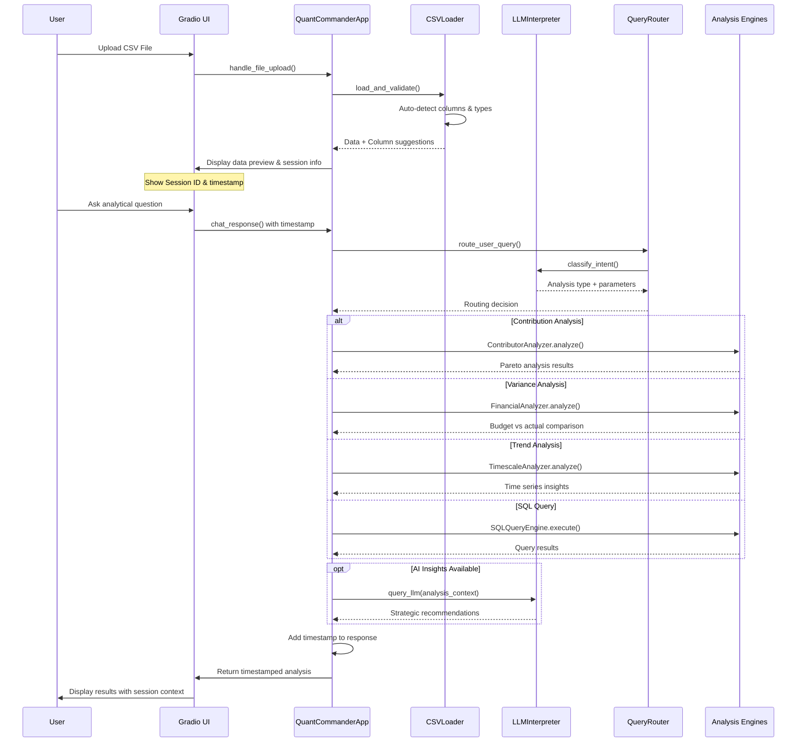
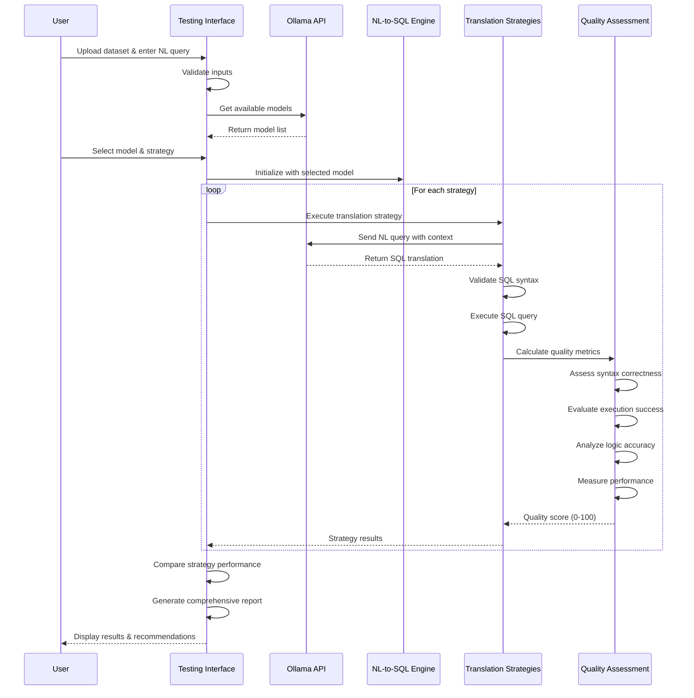

# VariancePro - AI-Powered Financial Intelligence Platform

<div align="center">
  
  
  [](https://opensource.org/licenses/MIT)
  [](https://www.python.org/downloads/)
  [](https://gradio.app/)
  [](https://github.com/sharkoil/variancepro)
</div>

## 🚀 Introduction

VariancePro is an AI-powered financial intelligence platform that transforms your CSV data into comprehensive business insights. Chat with Aria Sterling, your AI financial analyst, to get instant analysis including contribution analysis, variance reporting, trend analysis, and intelligent business recommendations.

**Key Features:**
- 🤖 **AI Chat Interface**: Natural language queries with intelligent responses
- 📊 **Advanced Analytics**: Contribution, variance, and trend analysis
- 🔒 **Privacy-First**: 100% local processing - your data never leaves your machine
- 📈 **Professional Reports**: Publication-ready tables and insights
- 🧠 **Smart Detection**: Auto-identifies data patterns and business context
- 🆔 **Session Management**: Timestamped responses with unique session IDs

## 🛠️ Technology Stack

- **Frontend**: Gradio web interface with responsive design
- **Backend**: Python with pandas for data processing
- **AI Engine**: Ollama with local model inference
- **Analysis**: Modular analyzer architecture
- **Security**: Zero-trust local processing

## 📋 Requirements

- **Python**: 3.8 or higher
- **Memory**: 8GB+ RAM (recommended for AI model performance)
- **Ollama**: Local AI inference engine with models
- **Browser**: Modern web browser (Chrome, Firefox, Safari, Edge)
- **Internet**: Optional (for news intelligence features only)

## 🚀 Installation

### 1. Clone the Repository
```bash
git clone https://github.com/sharkoil/variancepro.git
cd variancepro
```

### 2. Install Dependencies
```bash
# Install core dependencies
pip install -r requirements.txt
```

### 3. Install and Setup Ollama
```bash
# Visit https://ollama.ai for platform-specific installation

# Pull recommended models
ollama pull gemma3:latest      # Primary model
ollama pull deepseek-r1:14b    # Advanced reasoning
ollama pull qwen3:8b           # Fast responses

# Verify installation
ollama list
```

## 🎯 How to Run

### Main Application
```bash
# Start VariancePro
python app_new.py
```
Access at: `http://localhost:7871`

### Testing Framework
```bash
# Start NL-to-SQL Testing Framework
python test_enhanced_nl_to_sql_ui.py
```
Access at: `http://localhost:7862`

## 🧪 Testing Tools

### Enhanced NL-to-SQL Testing Framework
The testing framework allows you to evaluate Natural Language to SQL translation across multiple AI models:

**Features:**
- 🤖 Multi-model support (any Ollama-deployed model)
- 🔄 Strategy comparison (LLM-enhanced vs semantic parsing)
- 📊 Quality scoring with automated assessment
- � Performance metrics and response time tracking
- 🎨 Interactive web-based interface

**Usage:**
1. Launch the testing framework
2. Upload your dataset (CSV/Excel)
3. Select AI model from dropdown
4. Enter natural language queries
5. Compare translation strategies
6. Review quality scores and performance

**Example Test Queries:**
- "Show me the top 5 products by revenue"
- "Find customers with orders above $10,000"
- "Compare revenue between regions"
- "What are the sales figures for Q1?"

## 🏗️ System Architecture

### Main Application Flow



### Testing Framework Flow



## 🔮 Roadmap

### Immediate (Q3 2025)
- **Enhanced Session Management**: Persistent session storage and recovery
- **Advanced Timestamp Analytics**: Query performance tracking and optimization
- **Custom AI Models**: Fine-tuned models for financial terminology
- **Export Capabilities**: PDF and Excel report generation

### Short-term (Q4 2025)
- **📱 Mobile App**: Native iOS/Android apps for data access
- **🔄 Real-time Data**: Live data streaming and continuous analysis
- **👥 Team Collaboration**: Multi-user workspaces and sharing
- **📊 Advanced Visualizations**: Interactive charts and dashboards

### Medium-term (2026)
- **🤖 AutoML Integration**: Automated machine learning for predictions
- **🌍 Global Intelligence**: Expanded news sources and international coverage
- **🏢 Enterprise Edition**: SSO, advanced security, and compliance features
- **📋 Regulatory Compliance**: Built-in compliance reporting

### Long-term (2027+)
- **🧠 Predictive Analytics**: Advanced forecasting and trend prediction
- **🌐 API Ecosystem**: RESTful APIs for integration with business systems
- **🔒 Advanced Security**: Enterprise-grade encryption and audit trails
- **🎯 Industry Templates**: Pre-built analysis templates for specific sectors

## 📄 License

This project is licensed under the MIT License - see the [LICENSE](LICENSE) file for details.

## 🔗 Links & Resources

- **🏠 Repository**: [https://github.com/sharkoil/variancepro](https://github.com/sharkoil/variancepro)
- **📋 Issues**: [Report bugs and request features](https://github.com/sharkoil/variancepro/issues)
- **💬 Discussions**: [Community Q&A](https://github.com/sharkoil/variancepro/discussions)
- **🛠️ Ollama**: [Local AI inference platform](https://ollama.ai)
- **🎨 Gradio**: [Web UI framework](https://gradio.app)

---

<div align="center">
  <h3>🚀 Transform Your Financial Data Into Strategic Intelligence</h3>
  <p><em>Where Artificial Intelligence Meets Business Insight</em></p>
  
  **🎯 Professional Analysis • 🧠 AI-Powered Insights • 🔒 Privacy-First Architecture**
  
  <br>
  
  [](https://github.com/sharkoil/variancepro)
  [](https://github.com/sharkoil/variancepro/fork)
  [](https://github.com/sharkoil/variancepro)
</div>
