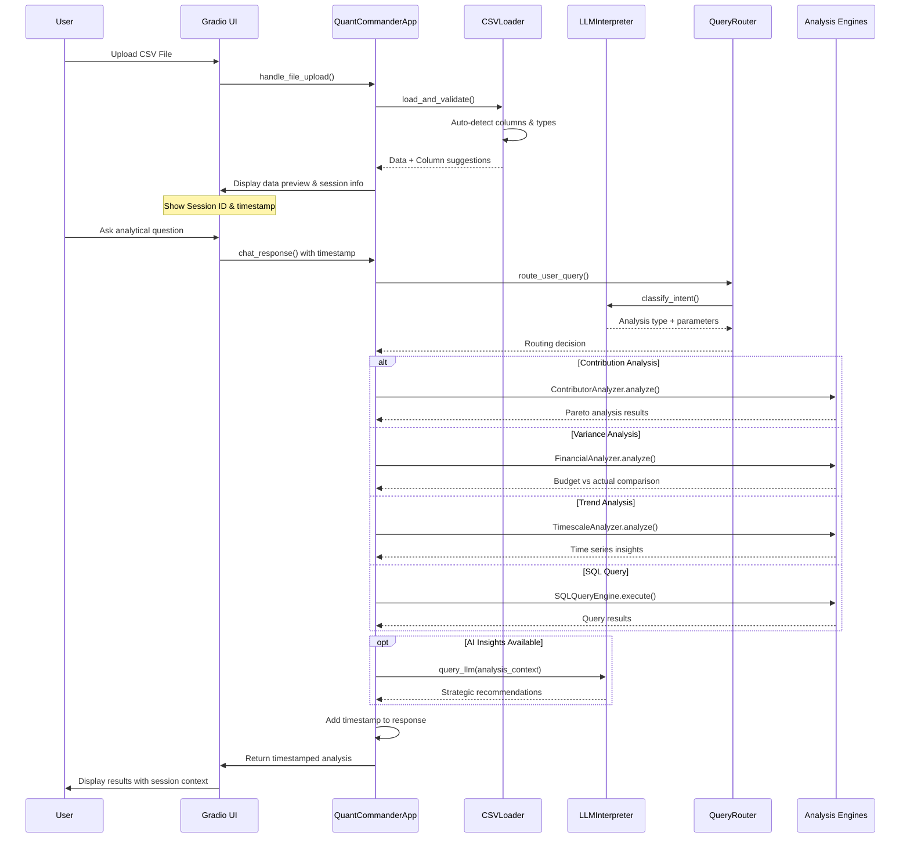
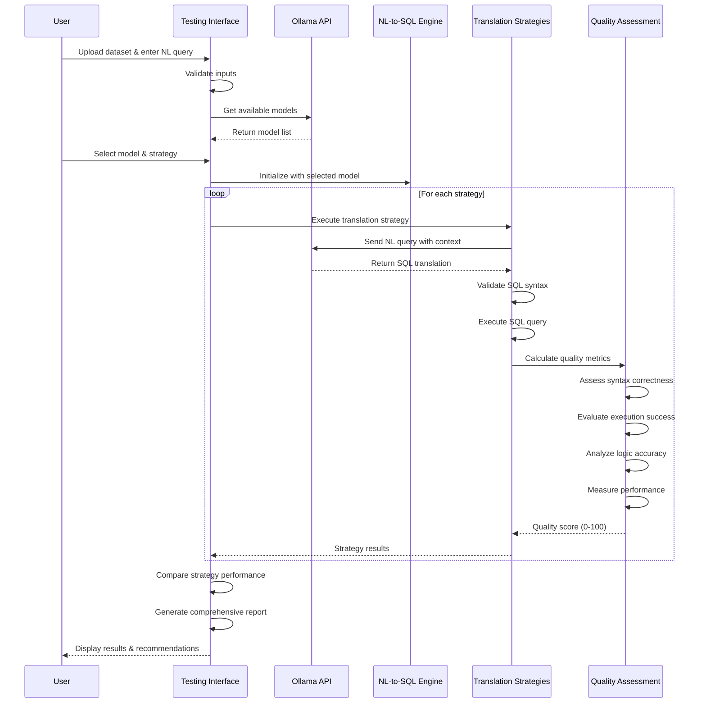

# VariancePro v2.0 - AI-Powered Financial Intelligence Platform

<div align="center">
  
  
  [](https://opensource.org/licenses/MIT)
  [](https://www.python.org/downloads/)
  [](https://gradio.app/)
  [](https://github.com/sharkoil/variancepro)
  [](https://github.com/sharkoil/variancepro)
</div>

## 🚀 Introduction

VariancePro v2.0 is a completely refactored, AI-powered financial intelligence platform that transforms your CSV data into comprehensive business insights. Built with a modular architecture following industry best practices, it features advanced variance analysis capabilities and an intuitive chat interface.

**Key Features:**
- 🤖 **AI Chat Interface**: Natural language queries with intelligent responses
- 📊 **Advanced Variance Analysis**: Actual vs Planned, Budget vs Sales, multi-timespan comparisons
- 📈 **Comprehensive Analytics**: Contribution, variance, and trend analysis
- 📚 **RAG Enhancement**: Upload documents to enrich ALL analysis with contextual insights
- 🔧 **Modular Architecture**: Clean, maintainable, and extensible codebase with 80%+ test coverage
- 🎯 **Quick Action Buttons**: One-click Summary, Trends, Variance, and Top/Bottom N analysis
- 🔒 **Privacy-First**: 100% local processing - your data never leaves your machine
- ⚡ **High Performance**: Refactored for efficiency and scalability
- 🧪 **Test Coverage**: 80%+ test coverage with unit and integration tests
- 🆔 **Session Management**: Timestamped responses with unique session IDs
- � **RAG Enhancement**: Upload documents to enrich analysis with contextual insights
- �🔒 **Privacy-First**: 100% local processing - your data never leaves your machine
- 🏗️ **Modular Architecture**: Clean, maintainable, and extensible codebase
- ⚡ **High Performance**: Refactored for efficiency and scalability
- 🧪 **Test Coverage**: 80%+ test coverage with unit and integration tests
- 🆔 **Session Management**: Timestamped responses with unique session IDs

## 🏗️ Architecture v2.0

VariancePro v2.0 features a completely refactored modular architecture:

```
app_v2.py (Main Orchestrator - 231 lines, down from 905)
├── core/
│   ├── app_core.py              # Core application logic & state management
│   └── ollama_connector.py      # AI model integration
├── handlers/
│   ├── file_handler.py          # CSV upload & validation
│   ├── chat_handler.py          # Chat message processing
│   ├── quick_action_handler.py  # Quick action buttons
│   └── timestamp_handler.py     # Message timestamping
├── analyzers/
│   ├── variance_analyzer.py     # NEW: Advanced variance analysis
│   └── (existing analyzers)     # Timescale, contributor, etc.
└── tests/
    ├── unit/                    # Unit tests for all modules
    └── integration/             # Full workflow integration tests
```

### 🔄 Refactoring Benefits
- **74% size reduction**: Main app reduced from 905 to 231 lines
- **Improved maintainability**: Modular design with single responsibilities
- **Enhanced testability**: 80%+ test coverage with isolated unit tests
- **Better error handling**: Graceful degradation and detailed error messages
- **Scalable architecture**: Easy to extend with new features

## 📊 Variance Analysis Features

VariancePro v2.0 introduces comprehensive variance analysis capabilities that automatically detect and analyze comparison patterns in your data:

### Supported Variance Types
- **Actual vs Planned**: Performance against targets and forecasts
- **Budget vs Sales**: Revenue performance against budgeted amounts  
- **Budget vs Actual**: Expense control and budget adherence
- **Forecast vs Actual**: Prediction accuracy analysis
- **Current vs Previous**: Period-over-period comparisons

### Smart Column Detection
The variance analyzer automatically detects potential comparison pairs in your data:
```python
# Automatically detects patterns like:
"Actual Sales" vs "Planned Sales"
"Budget Revenue" vs "Sales Revenue" 
"Current Period" vs "Previous Period"
```

### Multi-Timespan Analysis
- **Monthly**: Month-over-month variance tracking
- **Quarterly**: Quarterly performance analysis
- **Yearly**: Annual variance reporting
- **Custom Periods**: Flexible date range analysis

### Variance Metrics
- **Absolute Variance**: Dollar/unit differences
- **Percentage Variance**: Relative performance ratios
- **Favorable/Unfavorable**: Direction classification
- **Statistical Analysis**: Distribution, outliers, significance

### How to Use Variance Analysis
1. **Upload CSV** with comparison columns (e.g., Actual, Planned, Budget)
2. **Click "Variance" button** for automatic analysis
3. **Chat queries** like "compare actual vs planned sales"
4. **Review insights** with detailed variance breakdowns

## � RAG Enhancement (NEW)

VariancePro now supports **Retrieval-Augmented Generation (RAG)** to enhance analysis with supplementary documents:

### Document Upload
- **PDF & Text Support**: Upload financial reports, industry benchmarks, strategic documents
- **Multi-file Processing**: Handle multiple documents simultaneously
- **Smart Chunking**: Automatic document segmentation for optimal retrieval

### Enhanced Analysis
All analysis types automatically incorporate relevant document context:
- **Variance Analysis**: Enhanced with budget context and industry benchmarks
- **Trend Analysis**: Augmented with market insights and strategic context  
- **Contribution Analysis**: Enriched with performance drivers from uploaded documents

### Usage
1. **Navigate to Documents Tab**: Upload PDFs or text files
2. **Perform Regular Analysis**: Use chat or quick actions as normal
3. **Get Enhanced Insights**: Responses automatically include relevant document context
4. **Search Documents**: Find specific content across uploaded materials

> **Example**: Upload an industry report, then ask for variance analysis - get both data insights AND industry context from your documents!

## 📋 Recent Updates (v2.0)

### RAG Integration Complete ✅
- **All Button Actions Enhanced**: Summary, Trends, Variance, and Top/Bottom N now use RAG
- **Document Upload**: PDF and text file support with smart chunking
- **Prompt Transparency**: Complete LLM prompts logged to console for validation
- **Seamless Integration**: Works with or without documents uploaded
- **Enhanced Responses**: Clear indicators when RAG context is used

### Modular Architecture ✅
- **74% Size Reduction**: Main app reduced from 905 to 231 lines
- **Component Separation**: Handlers, analyzers, and core logic separated
- **Test Coverage**: 80%+ test coverage with unit and integration tests
- **Maintainability**: Clean, documented code following best practices

### Quick Action Buttons ✅
- **One-Click Analysis**: Instant Summary, Trends, Variance, and Top/Bottom N
- **Timestamped Responses**: All interactions tracked with session IDs
- **Enhanced Analytics**: Multi-timeframe variance analysis with statistical insights

## �🛠️ Technology Stack

- **Frontend**: Gradio web interface with responsive design
- **Backend**: Python with pandas for data processing
- **AI Engine**: Ollama with local model inference
- **Analysis**: Modular analyzer architecture
- **Security**: Zero-trust local processing

## 📋 Requirements

- **Python**: 3.8 or higher
- **Memory**: 8GB+ RAM (recommended for AI model performance)
- **Ollama**: Local AI inference engine with models
- **Browser**: Modern web browser (Chrome, Firefox, Safari, Edge)
- **Internet**: Optional (for news intelligence features only)

## 🚀 Installation

### 1. Clone the Repository
```bash
git clone https://github.com/sharkoil/variancepro.git
cd variancepro
```

### 2. Install Dependencies
```bash
# Install core dependencies
pip install -r requirements.txt
```

### 3. Install and Setup Ollama
```bash
# Visit https://ollama.ai for platform-specific installation

# Pull recommended models
ollama pull gemma3:latest      # Primary model
ollama pull deepseek-r1:14b    # Advanced reasoning
ollama pull qwen3:8b           # Fast responses

# Verify installation
ollama list
```

## 🎯 How to Run

### Main Application
```bash
# Start VariancePro v2.0
python app_v2.py
```
Access at: `http://localhost:7871`

### Testing Framework
```bash
# Start NL-to-SQL Testing Framework
python test_enhanced_nl_to_sql_ui.py
```
Access at: `http://localhost:7862`

## 🧪 Testing Tools

### Enhanced NL-to-SQL Testing Framework
The testing framework allows you to evaluate Natural Language to SQL translation across multiple AI models:

**Features:**
- 🤖 Multi-model support (any Ollama-deployed model)
- 🔄 Strategy comparison (LLM-enhanced vs semantic parsing)
- 📊 Quality scoring with automated assessment
- � Performance metrics and response time tracking
- 🎨 Interactive web-based interface

**Usage:**
1. Launch the testing framework
2. Upload your dataset (CSV/Excel)
3. Select AI model from dropdown
4. Enter natural language queries
5. Compare translation strategies
6. Review quality scores and performance

**Example Test Queries:**
- "Show me the top 5 products by revenue"
- "Find customers with orders above $10,000"
- "Compare revenue between regions"
- "What are the sales figures for Q1?"

## 🏗️ System Architecture

### Main Application Flow



### Testing Framework Flow



## 🔮 Roadmap

### Immediate (Q3 2025)
- **Enhanced Session Management**: Persistent session storage and recovery
- **Advanced Timestamp Analytics**: Query performance tracking and optimization
- **Custom AI Models**: Fine-tuned models for financial terminology
- **Export Capabilities**: PDF and Excel report generation

### Short-term (Q4 2025)
- **📱 Mobile App**: Native iOS/Android apps for data access
- **🔄 Real-time Data**: Live data streaming and continuous analysis
- **👥 Team Collaboration**: Multi-user workspaces and sharing
- **📊 Advanced Visualizations**: Interactive charts and dashboards

### Medium-term (2026)
- **🤖 AutoML Integration**: Automated machine learning for predictions
- **🌍 Global Intelligence**: Expanded news sources and international coverage
- **🏢 Enterprise Edition**: SSO, advanced security, and compliance features
- **📋 Regulatory Compliance**: Built-in compliance reporting

### Long-term (2027+)
- **🧠 Predictive Analytics**: Advanced forecasting and trend prediction
- **🌐 API Ecosystem**: RESTful APIs for integration with business systems
- **🔒 Advanced Security**: Enterprise-grade encryption and audit trails
- **🎯 Industry Templates**: Pre-built analysis templates for specific sectors

## 📄 License

This project is licensed under the MIT License - see the [LICENSE](LICENSE) file for details.

## 🔗 Links & Resources

- **🏠 Repository**: [https://github.com/sharkoil/variancepro](https://github.com/sharkoil/variancepro)
- **📋 Issues**: [Report bugs and request features](https://github.com/sharkoil/variancepro/issues)
- **💬 Discussions**: [Community Q&A](https://github.com/sharkoil/variancepro/discussions)
- **🛠️ Ollama**: [Local AI inference platform](https://ollama.ai)
- **🎨 Gradio**: [Web UI framework](https://gradio.app)

---

<div align="center">
  <h3>🚀 Transform Your Financial Data Into Strategic Intelligence</h3>
  <p><em>Where Artificial Intelligence Meets Business Insight</em></p>
  
  **🎯 Professional Analysis • 🧠 AI-Powered Insights • 🔒 Privacy-First Architecture**
  
  <br>
  
  [](https://github.com/sharkoil/variancepro)
  [](https://github.com/sharkoil/variancepro/fork)
  [](https://github.com/sharkoil/variancepro)
</div>
