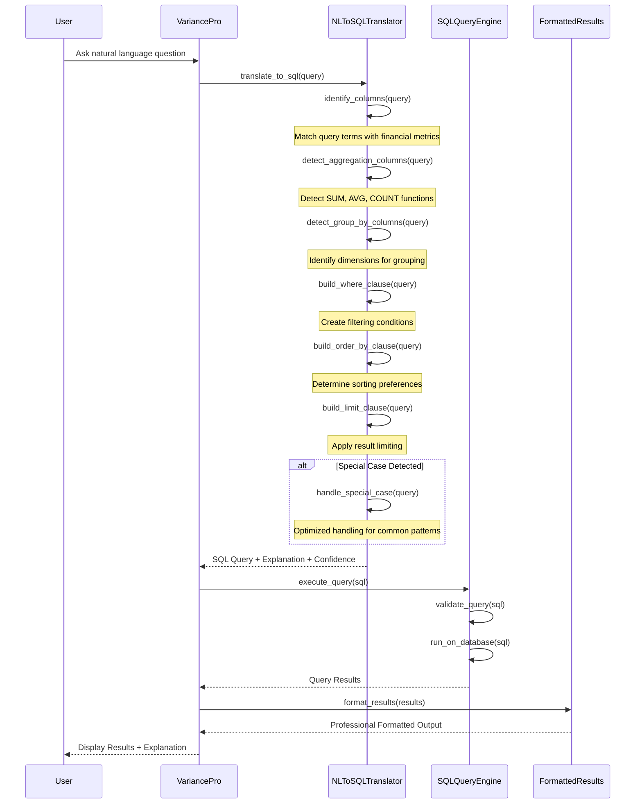

# Natural Language Interface

VariancePro's AI-powered chat interface allows you to analyze your data using natural language, making complex analytics accessible to everyone.

## 🤖 Meet Aria Sterling

Your AI financial analyst, Aria Sterling, understands business context and provides executive-level insights through natural conversation.

### Key Capabilities
- **Intent Recognition**: Automatically determines the best analysis type for your question
- **Context Awareness**: Remembers previous conversations and data context
- **Executive Summaries**: One-click access to AI-generated insights with expandable details
- **Market Integration**: Automatically includes relevant business context when applicable

## 💬 Natural Language Query Examples

### Basic Data Exploration
```
"What's in my data?"
"Show me a summary of the uploaded file"
"How many records do I have?"
"What columns are available?"
```

### Financial Analysis Queries
```
"Show me the top 10 products by sales"
"What are our revenue trends this quarter?"
"Compare budget vs actual performance"
"Which regions are underperforming?"
"Find our biggest profit drivers"
```

### Advanced Business Intelligence
```
"Generate an executive summary of Q3 performance"
"Analyze variance and explain external factors"
"What market factors might explain regional differences?"
"Which products drive 80% of our profits?"
"Show me seasonal patterns in sales data"
```

### Comparative Analysis
```
"Compare this month to last month"
"How does North region compare to South?"
"Show year-over-year growth by product"
"What's our best performing quarter?"
"Find products exceeding budget expectations"
```

### Predictive and Contextual Queries
```
"What does this trend suggest for next quarter?"
"How might current market conditions affect our sales?"
"What external factors could explain this variance?"
"Should we be concerned about this decline?"
"What opportunities do these patterns reveal?"
```

## 🔍 Enhanced NL-to-SQL Translation

VariancePro features a robust Natural Language to SQL translator that enables business users to query financial data using plain English.

### Key Features
- **Natural Language Queries**: Ask questions in plain English
- **Financial Domain Knowledge**: Built-in understanding of financial terminology
- **Pattern Recognition**: Advanced pattern matching for business metrics
- **Confidence Scoring**: Transparent query confidence with detailed explanations
- **Special Case Handling**: Optimized handling for common financial query patterns

### Supported Query Types

#### 1. Filtering Queries
```
"Show me sales greater than 60000"
"Find transactions where region is North"
"List products with discount > 5%"
"Get records from Q1 2024"
```

#### 2. Comparison Queries
```
"Find transactions where actual sales is less than budget sales"
"Show regions with customer satisfaction above 3"
"List products where variance is negative"
"Compare actual vs budget by region"
```

#### 3. Aggregation Queries
```
"Total actual sales by region"
"Average discount percentage by product line"
"Sum of revenue for each quarter"
"Count of transactions by category"
```

#### 4. Ranking Queries
```
"Top 5 regions by actual sales"
"Bottom 10 products by profit margin"
"Highest performing sales reps"
"Worst variance by product category"
```

#### 5. Complex Multi-Condition Queries
```
"Show regions with customer satisfaction above 3 and negative variance"
"Total actual sales by region where budget sales > 50000"
"Products with discount > 2% and sales < budget"
"Top performing products in North region for Q2"
```

## 🔄 Translation Process

### Sequence Diagram


## 🎯 Query Understanding

### Intent Classification
The AI automatically classifies your intent and routes to the appropriate analysis:

- **Exploratory**: "What's in my data?" → Data overview and summary
- **Analytical**: "Show trends" → Timescale analysis
- **Comparative**: "Compare regions" → Variance or ranking analysis
- **Explanatory**: "Why did this happen?" → Root cause analysis with market context

### Context Preservation
- Maintains conversation history
- References previous questions and results
- Builds on prior analysis
- Allows follow-up questions without re-context

### Business Logic Integration
- Understands financial terminology (revenue, profit, EBITDA, etc.)
- Recognizes business periods (Q1, YTD, fiscal year)
- Handles currency and percentage calculations
- Applies business rules and validations

## 🧠 AI Enhancement Features

### Executive Summary Generation
When you ask for analysis, the AI provides:
- **Key Findings**: Most important insights highlighted
- **Business Impact**: What this means for your business
- **Recommendations**: Specific actions to consider
- **Context**: Market factors and external considerations

### Expandable Detail Views
- **High-Level Summary**: Executive overview for quick consumption
- **Detailed Analysis**: Complete metrics and statistical breakdown
- **Technical Details**: SQL queries, confidence scores, methodology
- **Visual Indicators**: Trends, alerts, and performance markers

### Intelligent Follow-up
The AI suggests related questions:
```
Based on your variance analysis, you might also want to ask:
• "What external factors contributed to the North region outperformance?"
• "How do these results compare to industry benchmarks?"
• "What should we expect for next quarter based on these trends?"
```

## 💡 Best Practices

### Effective Query Formulation

#### Be Specific
```
✅ Good: "Show top 5 products by revenue in Q3 2024"
❌ Vague: "Show me some products"
```

#### Use Business Language
```
✅ Good: "Compare actual vs budget performance by region"
❌ Technical: "SELECT region, SUM(actual), SUM(budget) FROM..."
```

#### Ask Follow-up Questions
```
Initial: "What are our revenue trends?"
Follow-up: "What external factors might explain the Q2 spike?"
Deep-dive: "How do these trends compare to our competitors?"
```

### Progressive Analysis
1. **Start Broad**: "Give me an overview of my data"
2. **Drill Down**: "Show me details on the top performing region"
3. **Investigate**: "What factors contributed to this performance?"
4. **Act**: "What should I do about the underperforming areas?"

### Leveraging AI Insights
- Read the executive summaries for quick understanding
- Expand details when you need specific metrics
- Ask follow-up questions to explore interesting findings
- Use market context to understand external influences

## 🔧 Advanced Features

### Custom Analysis Requests
```
"Create a dashboard showing revenue, profit, and variance by region"
"Generate an executive report for board presentation"
"Build a monthly trend analysis with seasonal adjustments"
"Compare our performance to industry benchmarks"
```

### Integration with Business Context
- Automatic correlation with market news
- Industry-specific insights and comparisons
- Economic indicator integration
- Competitive intelligence inclusion

### Export and Sharing
- Generate presentation-ready outputs
- Create detailed reports with AI commentary
- Export data with context and insights
- Share analysis with stakeholders

---

The Natural Language Interface makes sophisticated financial analysis accessible to everyone, from C-suite executives to business analysts, enabling data-driven decision making through simple conversation.
