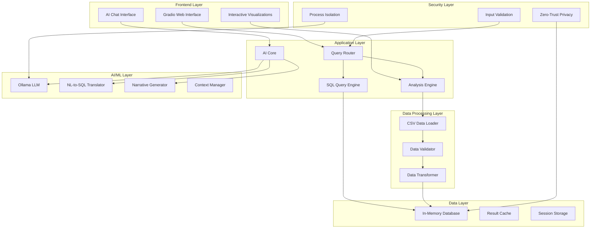
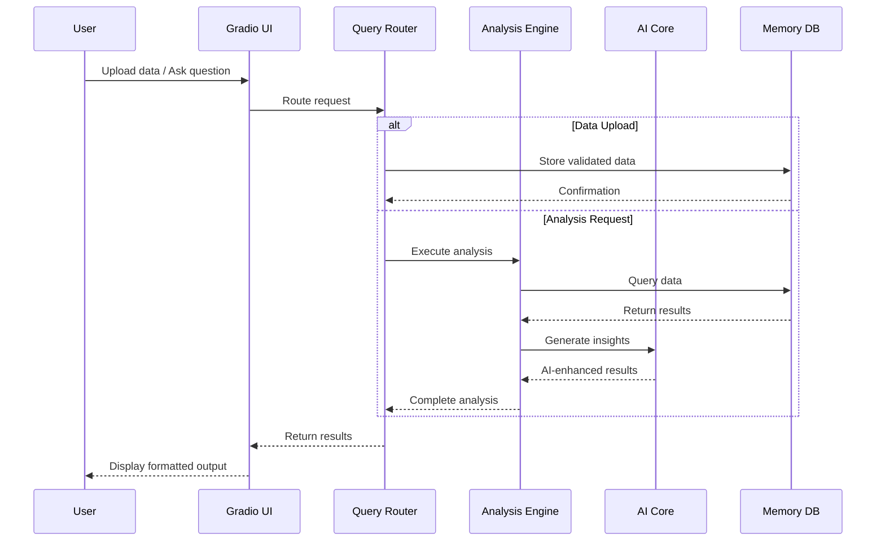
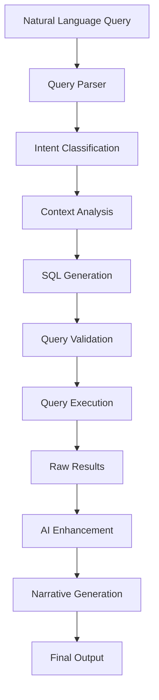
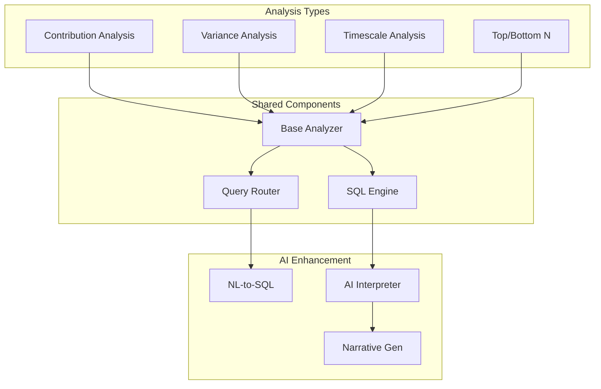
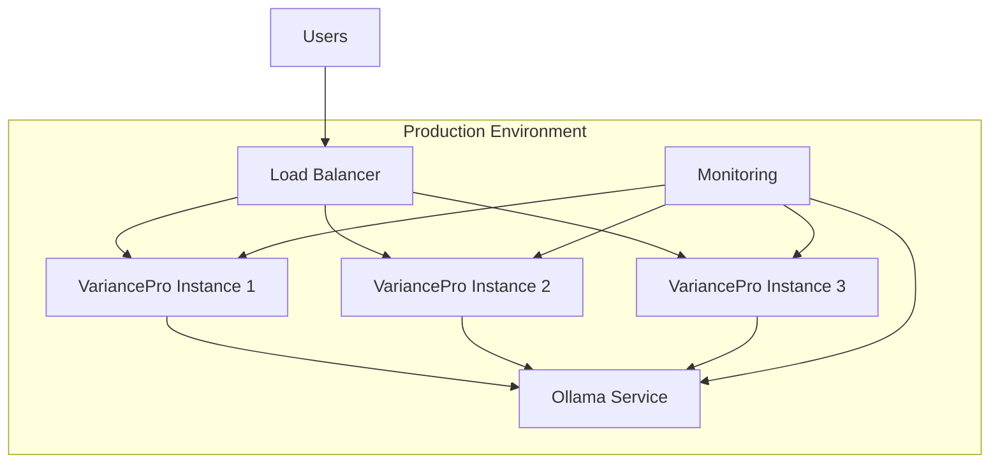

# System Architecture

VariancePro is built on a modular, secure, and scalable architecture designed for enterprise financial intelligence.

## 🏗️ High-Level Architecture



## 📦 Module Overview

### Core Components

#### 1. Application Entry Point (`app.py`)
- **Purpose**: Main application orchestrator and web interface
- **Technologies**: Gradio, Python
- **Key Features**:
  - Multi-tab interface (Upload, Analysis, Chat, Testing)
  - Session management and state preservation
  - Real-time chat interface with AI
  - File upload and validation

#### 2. AI Core (`ai/`)
- **LLM Interpreter** (`llm_interpreter.py`): Interfaces with Ollama models
- **Narrative Generator** (`narrative_generator.py`): Creates business-friendly explanations
- **Key Features**:
  - Local AI processing with zero external data transmission
  - Context-aware business intelligence
  - Executive summary generation

#### 3. Analysis Engine (`analyzers/`)
- **Base Analyzer** (`base_analyzer.py`): Common analysis interface
- **Specialized Analyzers**:
  - `contributor_analyzer.py`: Pareto 80/20 analysis
  - `financial_analyzer.py`: Core financial metrics
  - `timescale_analyzer.py`: Temporal trend analysis
- **SQL Components**:
  - `sql_query_engine.py`: Database query execution
  - `nl_to_sql_translator.py`: Natural language to SQL conversion
  - `query_router.py`: Intelligent query routing

#### 4. User Interface (`ui/`)
- **Gradio Integration**: Modern web interface
- **Interactive Components**: Charts, tables, chat interface
- **Responsive Design**: Desktop and mobile compatibility

#### 5. Data Management (`data/`)
- **CSV Loader** (`csv_loader.py`): Secure file processing
- **Data Validation**: Type checking and sanitization
- **In-Memory Processing**: Fast, secure data handling

#### 6. Configuration (`config/`)
- **Settings Management** (`settings.py`): Application configuration
- **Environment Variables**: Secure configuration management
- **Model Configuration**: AI model parameters

## 🔒 Security Architecture

### Zero-Trust Privacy Model

```mermaid
graph LR
    subgraph "Local Environment"
        User[User Data]
        App[VariancePro]
        Ollama[Local AI Models]
        Memory[In-Memory DB]
    end
    
    subgraph "Blocked Connections"
        Cloud[Cloud Services]
        External[External APIs]
        Remote[Remote Databases]
    end
    
    User --> App
    App --> Ollama
    App --> Memory
    
    App -.x Cloud
    App -.x External
    App -.x Remote
    
    style Cloud fill:#ffcccc
    style External fill:#ffcccc
    style Remote fill:#ffcccc
```

### Security Features

#### Data Privacy
- **No Cloud Dependencies**: All processing happens locally
- **Memory-Only Storage**: No persistent data storage
- **Session Isolation**: Each session is completely isolated
- **Secure File Handling**: Validated uploads with sanitization

#### AI Security
- **Local Models Only**: Ollama runs entirely on local hardware
- **No External API Calls**: Zero data transmission to external services
- **Model Isolation**: AI models run in isolated processes
- **Context Boundaries**: Strict context management and cleanup

#### Input Validation
- **SQL Injection Prevention**: Parameterized queries and validation
- **File Type Validation**: Strict CSV format enforcement
- **Size Limits**: Configurable upload and processing limits
- **Content Sanitization**: All user inputs are sanitized

## ⚡ Performance Architecture

### In-Memory Processing
```python
# Optimized data flow
Upload → Validation → Memory Database → Analysis → Results
```

### Caching Strategy
- **Query Result Caching**: Intelligent caching of analysis results
- **Model Caching**: AI model state preservation
- **Session Caching**: User context and conversation history

### Scalability Features
- **Modular Design**: Easy horizontal scaling
- **Stateless Components**: Components can be replicated
- **Resource Management**: Configurable memory and CPU limits
- **Concurrent Processing**: Multi-threaded analysis execution

## 🔄 Data Flow Architecture

### Analysis Pipeline



### Natural Language Processing Flow



## 🧩 Component Interactions

### Analyzer Ecosystem



### Configuration Management

```python
# Environment-based configuration
class Settings:
    # AI Configuration
    OLLAMA_BASE_URL: str = "http://localhost:11434"
    MODEL_NAME: str = "llama3.1:8b"
    
    # Security Settings
    MAX_FILE_SIZE: int = 100_000_000  # 100MB
    ALLOWED_EXTENSIONS: List[str] = ['.csv']
    
    # Performance Settings
    MAX_MEMORY_USAGE: int = 4_000_000_000  # 4GB
    QUERY_TIMEOUT: int = 30  # seconds
    
    # UI Configuration
    GRADIO_SHARE: bool = False
    GRADIO_AUTH: Optional[Tuple[str, str]] = None
```

## 🚀 Deployment Architecture

### Local Development
```bash
# Single-machine deployment
python app.py
# ↓
# Gradio server: http://localhost:7860
# Ollama server: http://localhost:11434
```

### Production Deployment


### Container Architecture (Future)
```dockerfile
# Multi-stage container build
FROM python:3.11-slim as base
# Install dependencies

FROM ollama/ollama as ai-service
# Configure AI models

FROM base as app
# Copy application code
# Configure for production
```

## 📊 Monitoring and Observability

### Health Checks
- **Application Health**: Component status monitoring
- **AI Model Health**: Ollama service monitoring
- **Memory Usage**: Real-time memory consumption tracking
- **Performance Metrics**: Query execution times and throughput

### Logging Strategy
```python
# Structured logging across components
import logging
import structlog

logger = structlog.get_logger()

# Example usage
logger.info("analysis_completed", 
           analysis_type="variance",
           execution_time=1.234,
           rows_processed=10000)
```

### Error Handling
- **Graceful Degradation**: Fallback mechanisms for AI failures
- **User-Friendly Errors**: Clear error messages and recovery suggestions
- **Automatic Recovery**: Self-healing for transient failures
- **Circuit Breakers**: Protection against cascading failures

## 🔧 Extension Points

### Custom Analyzers
```python
from analyzers.base_analyzer import BaseAnalyzer

class CustomAnalyzer(BaseAnalyzer):
    def analyze(self, data: pd.DataFrame) -> Dict[str, Any]:
        # Custom analysis logic
        return results
```

### Plugin Architecture
- **Analyzer Plugins**: Custom analysis types
- **AI Model Plugins**: Alternative AI backends
- **Data Source Plugins**: Additional data connectors
- **Visualization Plugins**: Custom chart types

### API Extensions
```python
# RESTful API endpoints (future)
@app.route('/api/v1/analyze', methods=['POST'])
def api_analyze():
    # Programmatic analysis access
    pass
```

---

This architecture ensures VariancePro remains secure, scalable, and maintainable while providing powerful financial intelligence capabilities through a modern, user-friendly interface.
