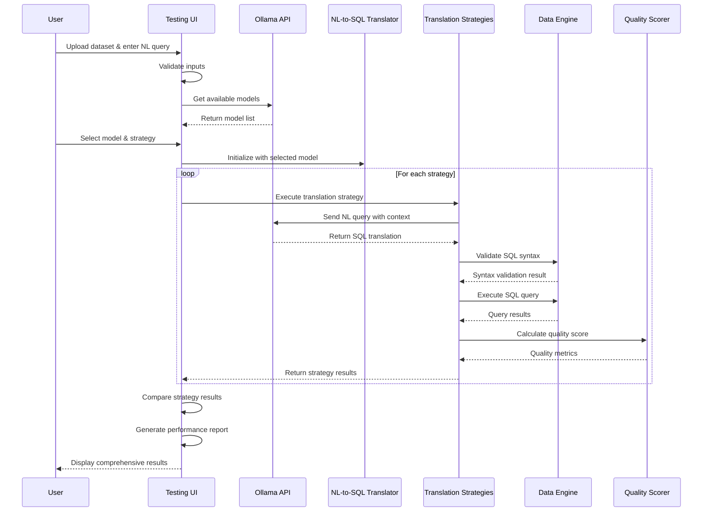

# Enhanced NL-to-SQL Testing Framework

VariancePro includes a sophisticated testing framework specifically designed for evaluating Natural Language to SQL translation capabilities across multiple AI models.

## 🎯 Framework Overview

The Enhanced NL-to-SQL Testing Framework provides:
- **🤖 Multi-Model Support**: Test with any Ollama-deployed model
- **🔄 Strategy Comparison**: Compare different translation approaches
- **📊 Quality Scoring**: Automated assessment of translation accuracy
- **📈 Performance Metrics**: Response time and success rate tracking
- **🎨 Interactive UI**: Web-based interface for easy testing and evaluation

## 🛠️ Core Components

### Framework Files
- `ui/nl_to_sql_testing_ui_enhanced.py` - Main testing interface with model selection
- `test_enhanced_nl_to_sql_ui.py` - Launcher script for the testing framework
- `analyzers/enhanced_nl_to_sql_translator.py` - Primary translation engine
- `analyzers/strategy_1_llm_enhanced.py` - LLM-enhanced translation strategy
- `analyzers/strategy_2_semantic_parsing.py` - Semantic parsing strategy
- `analyzers/nl_to_sql_tester.py` - Core testing and validation logic

### Color Scheme Fix
The testing framework includes comprehensive CSS fixes to ensure:
- Black text on white backgrounds for optimal readability
- Professional blue color scheme for interactive elements
- Clear contrast for all UI components
- Consistent styling across all tabs and sections

## 🚀 Getting Started

### Prerequisites
Ensure Ollama is running with your desired models:
```bash
# Check available models
ollama list

# Pull additional models if needed
ollama pull deepseek-r1:14b
ollama pull qwen3:8b
ollama pull llava:latest
```

### Launch the Testing Interface
```bash
# Navigate to project directory
cd f:\Projects\VARIANCEPRO

# Launch the enhanced testing UI
python test_enhanced_nl_to_sql_ui.py
```

**Access**: `http://localhost:7862`

### Alternative Launch Methods
```bash
# Direct launch of testing framework
python -c "from ui.nl_to_sql_testing_ui_enhanced import EnhancedNLToSQLTestingUI; EnhancedNLToSQLTestingUI().launch()"

# Background launch
python ui/nl_to_sql_testing_ui_enhanced.py
```

## 📋 Using the Testing Framework

### 1. Model Selection
- **Available Models**: Dropdown shows all Ollama-deployed models
- **Real-time Switching**: Change models without restarting the interface
- **Auto-refresh**: Click "🔄 Refresh Models" to detect newly installed models
- **Default Model**: Framework starts with `gemma3:latest` if available

### 2. Data Upload
- **Supported Formats**: CSV, Excel (.xlsx, .xls)
- **Auto-Detection**: Framework automatically detects column structure
- **Sample Data**: Use provided sample files for testing

### 3. Natural Language Query Testing

#### Example Test Queries
```
Basic Queries:
- "Show me the top 5 products by revenue"
- "What are the sales figures for the last quarter?"
- "Find customers with orders above $10,000"
- "Compare revenue between regions"

Complex Queries:
- "Show sales where region is North and amount > 15000"
- "Average discount percentage by product line"
- "Total actual sales by region where budget > 50000"
- "Find products with highest customer satisfaction"
```

### 4. Strategy Comparison
The framework tests multiple strategies simultaneously:
- **LLM Enhanced**: Uses advanced AI reasoning for complex queries
- **Semantic Parsing**: Rule-based approach for structured queries
- **Hybrid Approach**: Combines multiple strategies for optimal results

### 5. Quality Assessment
- **Syntax Validation**: Checks if generated SQL is valid
- **Execution Testing**: Runs queries against your data
- **Result Verification**: Validates query output makes sense
- **Performance Scoring**: 0-100 quality score with detailed breakdown

## 🔄 Testing Framework Workflow



## 📊 Understanding Test Results

### Quality Score Components
- **Syntax Score (0-25)**: SQL syntax correctness
- **Execution Score (0-25)**: Query runs without errors  
- **Logic Score (0-25)**: Query logic matches intent
- **Performance Score (0-25)**: Execution time and efficiency

### Result Interpretation
- **90-100**: Excellent - Production ready
- **75-89**: Good - Minor refinements needed
- **60-74**: Fair - Requires optimization
- **Below 60**: Poor - Needs significant improvement

## 🎛️ Advanced Configuration

### Custom Strategy Testing
```python
# Add custom translation strategies
from analyzers.strategy_1_llm_enhanced import Strategy1LLMEnhanced

# Test with specific parameters
strategy = Strategy1LLMEnhanced(
    model_name="your-model",
    temperature=0.1,
    max_tokens=1000
)
```

### Batch Testing
```python
# Run batch tests with multiple queries
test_queries = [
    "Show top customers",
    "Monthly revenue trends", 
    "Product performance analysis"
]

# Execute batch testing
python -c "from analyzers.nl_to_sql_tester import NLToSQLTester; tester = NLToSQLTester(); tester.run_batch_tests(test_queries)"
```

## 🔍 Troubleshooting

### Common Issues
1. **Model Not Found**: Ensure Ollama is running and model is installed
2. **Connection Error**: Check Ollama API endpoint (default: http://localhost:11434)
3. **Import Errors**: Verify all dependencies are installed: `pip install -r requirements.txt`
4. **Port Conflicts**: Change port in launcher: `demo.launch(server_port=7863)`
5. **Color Issues**: UI should now have proper contrast with recent fixes

### Validation Tools
```bash
# Validate framework syntax
python validate_nl_to_sql_syntax.py

# Test basic functionality
python test_framework_basic.py

# Check Ollama connectivity
curl http://localhost:11434/api/tags

# Test color scheme
python test_ui_colors.py  # Opens test UI on port 7863
```

### Debug Mode
```bash
# Enable testing framework debug
export NL_TO_SQL_DEBUG=1
python test_enhanced_nl_to_sql_ui.py
```

## 🎯 Best Practices

### Testing Strategy
1. **Start Simple**: Begin with basic queries before testing complex scenarios
2. **Use Representative Data**: Test with datasets similar to your production data
3. **Compare Models**: Test multiple models to find the best fit for your use case
4. **Document Results**: Keep track of which models/strategies work best for different query types
5. **Iterative Testing**: Refine queries based on initial results

### Query Design
- Start with simple filtering queries
- Progress to aggregation and grouping
- Test complex multi-condition queries
- Validate edge cases and error handling

### Performance Optimization
- Use lightweight models (qwen3:8b) for faster responses during development
- Switch to powerful models (deepseek-r1:14b) for production-quality results
- Monitor response times and adjust timeout settings

## 📈 Extending the Framework

### Adding New Strategies
1. Create a new strategy class inheriting from `NLToSQLStrategy`
2. Implement the `translate` method
3. Add strategy to the testing UI configuration
4. Test and validate with sample queries

### Custom Quality Metrics
1. Extend the quality scorer with domain-specific metrics
2. Add business logic validation
3. Implement custom performance benchmarks

---

The Enhanced NL-to-SQL Testing Framework provides a comprehensive platform for evaluating and improving natural language query capabilities across different AI models and strategies.
